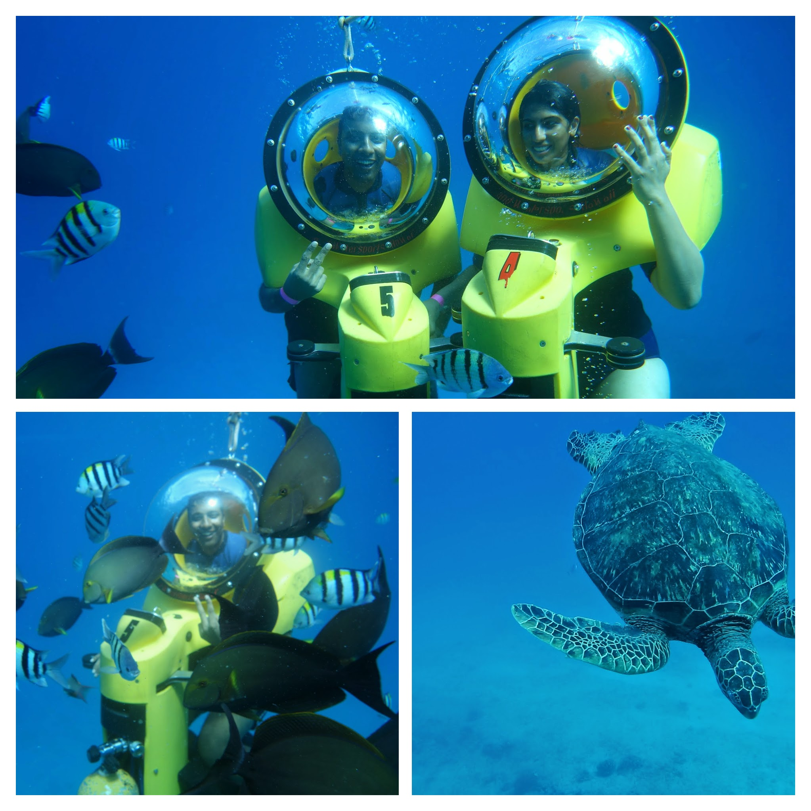
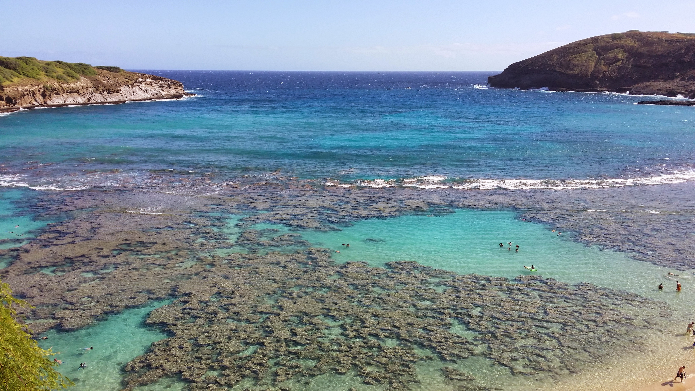
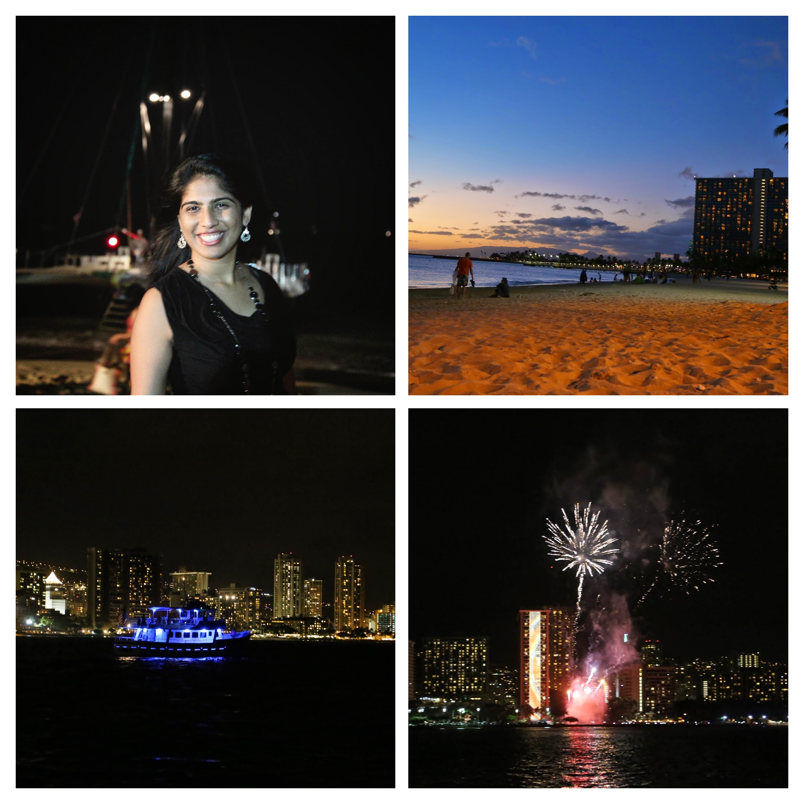
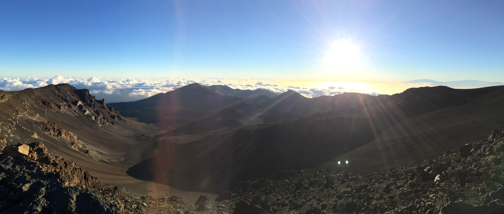

Hawaii is a dream destination. Who would not fall in love with a tropical paradise. And it has sand! Loads and loads of it. 

Needless to say, it is expensive!! While we did some grocery shopping to save money on breakfast (no free brekkie, and for the vegetarians the buffet is not worth the money), there wasnt much skimping we could do with stay. This was our third trip to the island and we realized that staying in a resort by the beach is the best way to experience the paradise. 

Every island in hawaii has something to offer. I am going to post a few pictures from our previous trips as well.

## Oahu - a little bit of everything! 
Honolulu is a mix of everything, it is like every other US city with busting crowds in the downtown area. It does have some really beautiful corals and scooba areas too. . 

We arent great swimmers so scooba diving wasnt really an option. But dont fret, there are scooba scooters!
 

Hanuma Bay is by far my favorite snorkelling place. The beach is fresh and sandy, and the corals are right beside you. Our trip to Oahu, was before we were parents, but this is perfect to bring toddlers too. 

If your child is closer to 5 you could get a kid-sized snorkel from the store. Otherwise there is plenty of sand that would keep a younger toddler busy, while you can take turns snorkelling

Waikiki. Sunset, late into night, during the day this place always has something to offer!

#Maui
Maui is so peaceful and serene. I found out I was pregnant in Maui, so it is an extra special place for us :) 

But that also meant I was car sick and we could not do much of the longer drives. 

Drive up to haleakala for a sunrise view. It is a bit of a drive and we started out at 4 AM. It was also very very cold!

